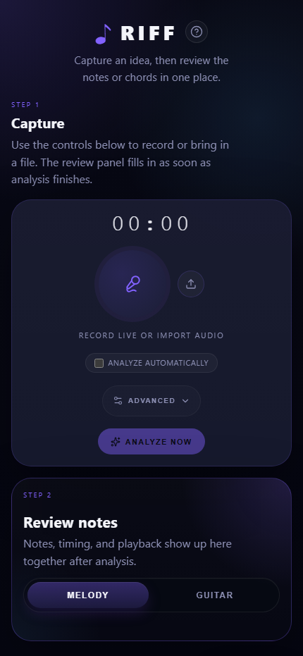

# Riff

Riff is a browser-based polyphonic music transcription app for capturing a musical idea and turning it into notes, chords, playback, and exports without leaving the device.

It records from the microphone or imports audio files, runs Spotify's [Basic Pitch](https://github.com/spotify/basic-pitch) entirely client-side in a Web Worker, and keeps storage local with no backend or account system.

## App preview

<p align="center">
  
</p>

## At a glance

- Status: experimental prototype
- Runtime: browser-only, no backend
- Privacy: audio stays on-device unless exported
- Inputs: microphone recording or file import
- Outputs: notes/chords review plus MIDI/WAV/MP3 export

## What the app does today

- Record live audio or import an existing audio file
- Analyze automatically or manually after capture
- Review results in two lanes:
  - **Notes** for pitch, timing, note preview, and piano-roll playback
  - **Guitar** for key, chord changes, substitutions, and playable chord shapes
- Save riffs locally and reload them later
- Show saved audio format on riff cards (`PCM`, `WebM`, `M4A`, `Ogg`, and similar)
- Export **MIDI**, **WAV**, **MP3**, and the original compressed capture when available
- Display the deployed build identity as `v<version> · <short-sha>` in the help modal and browser console
- Work as an installable PWA with cached model assets for repeat use

## Product flow

1. **Capture** with the microphone or import a file
2. **Analyze** with Basic Pitch in a worker thread
3. **Review** notes, chords, key, timing, and guitar voicings
4. **Playback** either the recorded audio or the MIDI preview
5. **Export** what you want to keep

```text
Mic / Imported audio
  -> AudioWorklet capture + decode
  -> Basic Pitch in Web Worker
  -> note mapping + chord detection + profile filtering
  -> local session storage + playback + export
```

## Architecture highlights

- `useRiffSession` is the orchestration layer for recording, analysis, playback, saved sessions, and export state.
- `useAudioRecorder` handles microphone capture and iOS-friendly resampling.
- `usePitchDetection` sends audio to `pitchDetection.worker.ts`, throttles progress updates, and supports model preload.
- Instrument profiles tune note filtering and chord-window behavior for guitar-first and full-range analysis.
- Saved session metadata lives in IndexedDB via `idb`.
- Audio persistence prefers OPFS and falls back to IndexedDB blobs when OPFS is unavailable.
- MIDI preview uses a sampler-based playback hook with stop protection and a piano-roll playhead.

## Tech stack

| Layer | Technology |
| --- | --- |
| UI | React 19 + TypeScript |
| Build | Vite 7 |
| Testing | Vitest + Playwright |
| Audio capture | Web Audio API + AudioWorklet |
| Pitch detection | `@spotify/basic-pitch` + TensorFlow.js |
| Music theory | Tonal / `@tonaljs` |
| Local storage | IndexedDB (`idb`) + OPFS fallback |
| Deployment | Vercel + `vite-plugin-pwa` |

## Local development

```bash
npm install
npm run dev
```

The dev server runs at `http://localhost:3000`.

Useful commands:

```bash
npm run build
npm run readme:image
npm run test
npm run test:watch
npm run test:coverage
npm run test:e2e
npm run release:check
```

Focused runs also work:

```bash
npm run test -- src/components/OnboardingSheet.test.tsx
npx playwright test tests/e2e/smoke.spec.ts
```

## Build identity and releases

Riff injects build metadata at build time from `package.json` and the current Git SHA.

- The app logs `Riff build v<version> · <short-sha>` on startup
- The help / instructions modal shows the same build label in its top-right corner
- Vercel deployments automatically pick up the correct commit SHA when `VERCEL_GIT_COMMIT_SHA` is present

Typical release flow:

```bash
npm version patch
npm run release:check
git push origin main --follow-tags
```

Pushes to `main` also run a dedicated workflow that refreshes `image.png` so the README screenshot stays aligned with the current landing page.

## Deploying to Vercel

Riff is a static Vite app and deploys cleanly to Vercel.

### Dashboard flow

1. Import the GitHub repository into Vercel
2. Confirm:
   - Build command: `npm run build`
   - Output directory: `dist`
3. Deploy

### CLI flow

```bash
npx vercel login
npx vercel
npx vercel --prod
```

`vercel.json` is committed so the expected Vite build/output settings stay consistent.

## Storage and browser notes

- Audio never leaves the device unless the user exports it
- OPFS is the primary audio store where supported
- IndexedDB blob fallback covers browsers without OPFS support
- Model assets are cached for offline-friendly repeat use
- iOS Safari still requires playback/recording to begin from a user gesture, so `AudioContext.resume()` is kept explicit

## Project structure

```text
src/
├── App.tsx                         # Main shell and lane orchestration
├── components/
│   ├── Recorder.tsx                # Capture/import controls + advanced options
│   ├── Playback.tsx                # Recorded audio playback
│   ├── PianoRoll.tsx               # MIDI preview controls + playhead
│   ├── ChordTimeline.tsx           # Timeline of detected chord events
│   ├── ChordFretboard.tsx          # Guitar voicing diagrams
│   ├── SessionPicker.tsx           # Saved riffs UI
│   ├── ExportPanel.tsx             # MIDI/WAV/MP3/native export actions
│   └── OnboardingSheet.tsx         # Help, instructions, and build identity
├── hooks/
│   ├── useRiffSession.ts           # App-level state machine
│   ├── useAudioRecorder.ts         # Mic capture + resampling
│   ├── usePitchDetection.ts        # Worker bridge + progress handling
│   └── useMidiPlayback.ts          # MIDI preview playback and current time
├── lib/
│   ├── db.ts                       # Saved session schema and IndexedDB helpers
│   ├── audioStorage.ts             # OPFS / IndexedDB audio persistence
│   ├── audioExport.ts              # MIDI, WAV, and MP3 export
│   ├── instrumentProfiles.ts       # Detection profiles
│   ├── noteMapper.ts               # MIDI -> note names
│   ├── chordDetector.ts            # Chord and timeline detection
│   └── buildInfo.ts                # Version + commit label
└── workers/
    └── pitchDetection.worker.ts    # Basic Pitch inference off the main thread
```

## Browser support

Riff targets modern browsers with Web Audio, Web Workers, and WebGL support:

- Chrome / Edge
- Safari
- Firefox
- Samsung Internet and other Chromium-family mobile browsers

Behavior can vary by platform, but the app now includes storage fallbacks and iOS playback safeguards for the main supported flows.

## License

ISC
